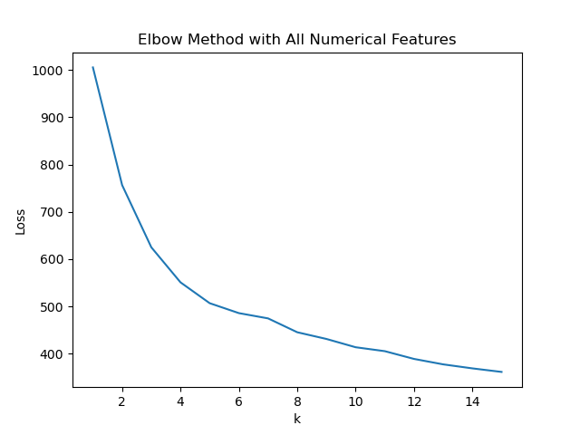
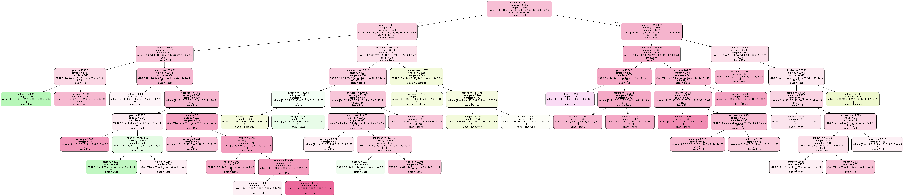

# [CS4641](https://xinchen384.github.io/cs4641B-summer2020/) Machine Learning Project
This is a collaboration between Nathan Luskey, Reagan Matthews, Dylan Reese, & David Wen.
## Project Overview
Our goal is to match *your* music tastes for customized running playlists. For the deliverables see our final [report](deliverables/FinalProjectReport.pdf) & [presentation](deliverables/FinalPresentation.pdf)

## Problem & Background
#### Who?
We want to help *you* find songs to match *your* workout tempo __and__ personal taste of music.  

#### How?
We used 2 different methods:
- Unsupervised: K-means clustering + PCA
Optimized via the elbow method shown below:

All code can be seen in the unsupervisedLearning directory.

- Supervised: Decision Tree with $\alpha$ Pruning and Genre as Label

All code can be seen in the supervisedLearning directory.
## Data
- The [million songs data](http://millionsongdataset.com/).
All code can be seen in the SQLTesting directory.

## Packages
- The data used in this project is obtained with dolthub, so you will need to install [dolt](https://www.dolthub.com/docs/tutorials/installation/) and [doltpy](https://www.dolthub.com/docs/tutorials/installation/).
- The machine learning was done using [scikit](https://scikit-learn.org/stable/)
- Visualizations used [pyplot](https://matplotlib.org/api/pyplot_api.html)
- Created csv using [pandas](https://pandas.pydata.org/)

